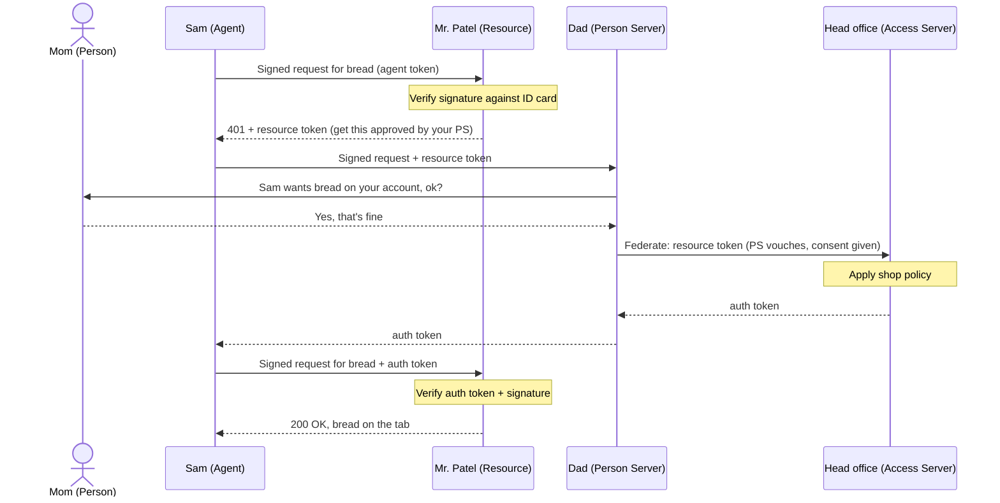
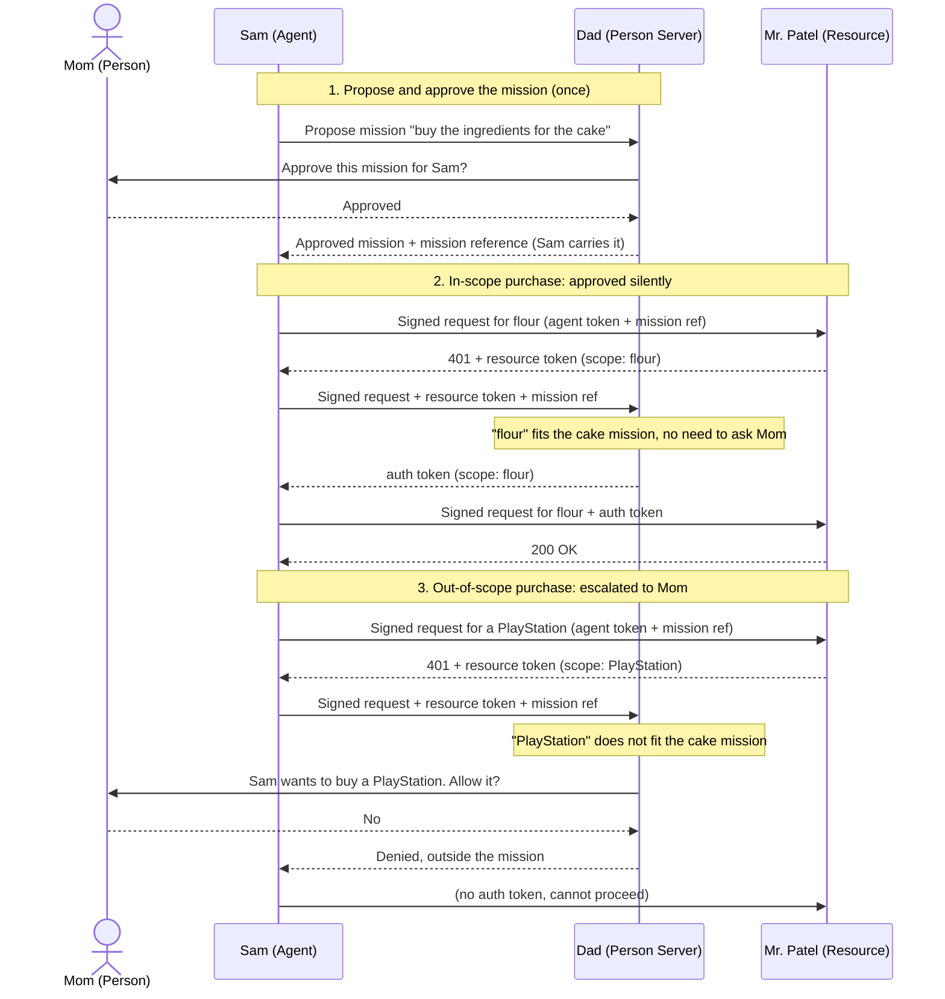

*A story about what it really takes to send someone to do a job for you, and why that turns out to be a genuinely hard problem we're now being forced to solve because of AI agents.*

AI agents are software that doesn't just answer questions, it goes off and *does things* for you: books the flight, files the expense, orders the groceries, emails the client. The moment software starts acting on your behalf in the real world, spending your money and touching your accounts, a hard question shows up: how does everyone involved know the agent is really acting for you, only doing what you allowed, and nothing more?

**AAuth** is a protocol built to answer exactly that. It gives an agent its own provable identity, a way to carry your authority without holding the keys to your whole life, a trusted party that can confirm your consent in the moment, and a way to wrap an open-ended job in an approved "mission" that can be checked and called off. You can read more about it at [aauth.dev](https://aauth.dev/).

This post is the gentle on-ramp. Instead of starting with tokens and signatures and well-known endpoints, we'll start with something everyone already understands: a parent sending a kid to the corner shop. By the end you'll have a feel for the whole problem space AAuth is trying to cover, from the easy parts that are basically solved to the genuinely hard parts that the industry is still working out, and the jargon will stop feeling like a foreign language. No prior identity or security background needed.

## Picture it: a summer afternoon in the 1990s

Before we start, set the dial back a few decades. It's the '90s. No smartphones, no apps, no tap-to-pay. If you needed milk, you sent one of the kids down to the corner shop, and the shopkeeper put it "on the tab" because your family had an account there. People knew each other. Trust ran on faces, reputations, and the landline phone on the kitchen wall.

  

That world turns out to be the perfect place to understand a very modern problem: how to safely let *something else* act on your behalf. So let's go back there for a bit.

## Meet the cast

Here are the people in our story. There are only a few, and you already understand all of them from real life.

- **Mom.** She's the one in charge. She decides what's allowed, and the bills come to her. When something goes wrong, it's her problem. Everyone else is acting *for* her. *(In AAuth, Mom is the **Person**.)*
- **Sam.** Mom's kid. Sam is the one who actually goes out and does things: walks to the shop, asks for the goods, carries them home. Here's the twist that matters. Sam doesn't carry cash. Mom has an account at the shop, and Sam buys on it. So Sam has no money and no authority of his own. Everything he does, he does on Mom's say-so, and it lands on Mom's tab. *(In AAuth, Sam is the **Agent**.)*
- **Mr. Patel.** He runs the corner shop. Mom has shopped there for years, so the shop knows her and runs a tab for her. He decides whether to let a purchase go on that tab. He does *not* know Sam well, and he's not going to charge Mom's account just because a kid says "my mom sent me." *(In AAuth, Mr. Patel is the **Resource**.)*
- **Dad.** Sam's dad, who's at work across town. Mr. Patel knows Dad and trusts him. If the shop is ever unsure about a purchase, Mr. Patel can ring Dad at the office, and Dad can check with Mom directly ("hey, did you send Sam for this?") and confirm it on the spot. Dad is the trusted person who can speak to whether Mom really wants this, right now, in the moment. *(In AAuth, Dad is the **Person Server**.)*
- **Head office.** Mr. Patel's shop is part of a chain. Head office holds the account relationship with Mom and sets rules that Mr. Patel has to follow, no matter what a customer (or their mom) wants. *(In AAuth, head office is the **Access Server**.)*

That's it. A mom, her kid, a shopkeeper, a trusted dad, and a rulebook.

One thing to notice up front: because Sam buys on credit instead of paying cash, the shop is trusting *Mom's account*, not a fistful of dollars. That makes getting the identity right far more important. A thief with stolen cash steals the cash and that's the end of it. A fake "Sam" who can charge Mom's tab can keep spending Mom's money until someone notices. No money changes hands at the counter, so the only thing protecting Mom is the shop correctly checking who Sam is and that Mom really authorized this.

## What we're trying to learn

Here's the thing this whole story is about:

> How do you safely send *someone else* to do a job for you?

That sounds easy. We do it all the time. We send kids to shops, assistants to meetings, contractors into our homes. But when you slow down and look at what actually has to be true for it to work, and *not* go wrong, it gets surprisingly deep.

It's also a question we're suddenly being forced to answer carefully, because we've started building **AI agents**: programs that go off and do things for us. Book the trip. Answer the email. Buy the groceries. An agent is just Sam, except Sam is software, the shop is some website's API, and Mom is you. The problem isn't brand new (we were solving a version of it in that '90s corner shop) and it isn't unsolvable. It's a hard problem that used to stay comfortably in the background, and agents have dragged it into the foreground.

So we're going to follow one family running one errand. We'll start with something tiny, *go buy a loaf of bread*, and build up to something open-ended, *go buy the ingredients for a birthday cake*. By the end you'll see exactly where the easy version stops being easy, and why the open-ended version is the part people are still actively working out.

Let's go.

---

## Part one: a loaf of bread

### "Go buy a loaf of bread"

Mom says, "Run to Patel's and get a loaf of bread, put it on our account." Sam heads out the door with no money in his pocket.

Done. Simplest thing in the world, right?

Except, pause for a second and look at everything that has to quietly work for this to go okay. Sam has to convince Mr. Patel that he is who he says he is. He has to convince him that Mom actually sent him. And Mr. Patel has to be willing to put it on Mom's tab, which means he's trusting that it really is Sam and that Mom really is good for it.

With real kids and real shopkeepers, all of this happens automatically and we never think about it. But if you had to *build* this trust from scratch, which is exactly what you have to do with software, you'd have to handle every piece by hand. So let's handle them, one at a time.

### Who are you, really?

The first problem: anyone can walk into the shop and say "Mom sent me, put it on her account."

Saying your name is just a *claim*. It's air. Some other kid could walk in, say he's Sam, and walk off with goods charged to Mom's tab. A name proves nothing on its own. And remember, because it's all on credit, a convincing fake doesn't just grab one loaf and run. He can keep charging Mom's account until somebody catches on.

What Sam needs is some way to prove he's actually *him*, something an impostor can't fake just by overhearing the errand. Think of it like this: Sam signs his name on the receipt, and Mr. Patel checks that signature against the one on Sam's ID card. Saying "I'm Sam" is free; *producing Sam's signature and having it match the card* is not. The ID card is the reference everyone can check against, and only the real Sam can produce a matching signature on the spot.

(The real version is even stronger than a handwritten signature, which a determined forger could trace. The software equivalent can't be copied even by someone who has watched Sam sign a hundred times: anyone can *check* a signature, but only the real Sam can *produce* one. Hold onto that idea, because it's the whole foundation.)

So that's step one. Not "what's your name," but "prove it."

### Says who?

Now here's the part people skip, and it's the important one.

Suppose Mr. Patel is totally convinced this really is Sam. Great. It still isn't enough, because **Sam is a kid.** He has no money of his own and no standing to charge Mom's account on his own whim. Knowing it's really Sam tells you *who's standing there*. It tells you nothing about whether he's *allowed to do this*.

The thing that actually matters isn't Sam's identity. It's that **Mom authorized this, and Sam is carrying her authority.** Sam isn't acting as himself. He's acting *on behalf of* Mom.

The first instinct is a note: Mom scribbles "Sam can buy bread on our account, Mom" and pins it to him. Better than nothing, but a note is weak. Someone could forge Mom's handwriting. Someone could copy it. Worse, Sam could keep the note and reuse it next week for something Mom never agreed to. A note proves Mom said something *once*. It doesn't prove she means it *now*.

So a scrap of paper isn't enough. We need something better than a note.

### How does the shop actually check?

Mr. Patel has a real problem. He knows Mom has an account, but he doesn't have a quick way to confirm that *this particular purchase* is one she actually wants. He can't tell a real note from a fake one. So how can he safely charge Mom's tab for a kid acting on her behalf?

Here's the move that makes the whole thing work: Mr. Patel picks up the shop phone and rings Sam's dad at the office, whom he already trusts. Dad checks with Mom, then comes back on the line: "Yes, that's Sam. Yes, his mom sent him. Yes, a loaf of bread on the account is fine."

Now Mr. Patel can serve Sam with confidence, without having to track Mom down himself. He just had to trust Dad, and let Dad confirm Mom's wishes for him.

That trusted middle person is the secret ingredient that lets people who don't know each other well delegate safely. Dad's whole job here is to represent the family to the shop and answer for what Mom wants. (In AAuth, this trusted middle party is the **Person Server**. But the name doesn't matter. What matters is the idea: a trusted party that can vouch for the person and confirm their consent in real time.)

### The shop has its own rules, too

One more wrinkle before we leave the bread aisle.

Mr. Patel's shop is part of a chain, and head office has rules. Say one of them is: "Don't put tobacco on a family account for a kid, even if a parent okays it." So now there are *two* gates, not one. Mom has to approve, *and* the shop's own rulebook has to allow it.

This matters more than it looks. Mom's authority does **not** overrule the shop. If head office says no, it's no, even with a signed, verified, totally legitimate okay from Mom. The person's permission sits *underneath* the shop's own policy, not above it. (In AAuth, the shop's rulebook lives in the **Access Server**. Again, the name's not the point. The point is: the place you're acting on doesn't give up its own rules just because you brought permission.)

---

So far, so good. We've actually solved a real problem here. Sam can be trusted to go fetch a *specific* thing on Mom's account:

- He can prove he's really Sam.
- He can prove he's carrying Mom's authority, not acting on his own.
- The shop can check all of it by phoning Dad, who confirms Mom's wishes, and it already has an account relationship with Mom to fall back on.
- And the shop still gets to enforce its own rules on top.

If errands were always this tidy, we'd be done. The trouble is, real jobs are almost never a single, specific, written-down thing.

Watch what happens when Mom asks for something *bigger*.

---

## Part two: "buy the ingredients for the cake"

### One ask, a hundred little actions

This weekend Mom doesn't hand Sam a list. She says:

> "Buy the ingredients for your sister's birthday cake."

And walks off.

Notice what just happened. There's no shopping list. Sam has to *figure out* what "the ingredients for the cake" even means. Flour. Eggs. Sugar. Butter. Oh, they're out of vanilla. Oh, there's no cake tin, better grab one. Each of these is a decision Sam makes *as he goes*, discovering what's needed in the middle of doing the job, and charging each one to Mom's account.

**Nobody could have written the permission list up front, because the job invents itself as it happens.**

Hold onto that sentence, because it's the whole reason AI agents are hard. A normal program is a kid with an exact list: buy *this*, buy *that*, come home. An agent is a kid told "buy what you need for the cake" who has to work the rest out alone. The first kind, we've basically figured out. The second kind is where the real work is now.

### What's inside the job, and what isn't?

So Mom's authority now has to cover "whatever it takes to buy the cake ingredients," all of it on her tab. Which immediately raises a nasty question: what *does* it take, exactly?

Flour? Obviously fine. A PlayStation? Obviously not. Easy at the extremes. But the trouble lives in the messy middle:

- The fancy imported chocolate, "to make it nicer"?
- A second batch of ingredients, "in case the first cake flops"?
- Sprinkles, candles, a card, a balloon. Are those "the cake" or not?

Sam can talk himself into almost anything being "for the cake." And here's the catch: the job was handed to him in *words*, not as a checklist. So whether any given purchase is "inside the cake" isn't a clean yes or no. It's a *judgment call*. And the one making that judgment is Sam, the kid with the account, who really wants this to go well and maybe wouldn't mind some leftover chocolate.

A narrow, specific job is easy to check. A broad, fuzzy goal is easy to *state* and genuinely hard to *fence in*.

### The note from last weekend

Here's the sneaky one. The one almost nobody sees coming.

Rewind to *last* weekend. Mom sent Sam for picnic supplies: bread rolls, juice, paper plates, the works. Sam went shopping, charged it all to Mom's account, and every bit of it was completely justified at the time. Good kid. Perfect errand.

Now it's *this* weekend. The picnic is long over. But Sam still has last week's note in his pocket that says "buy the picnic stuff." The account is still open. And if he walked into Patel's right now and loaded up on juice and paper plates again, the shop would still honor it.

Same kid. Same note. Same shop. Same everything, except the job is **already finished.**

The permission didn't expire, but the *reason for it* did. The authority is stale: it was granted for a goal that's already complete, and nothing about the note knows that. A piece of paper has no sense of "done." It just keeps saying "buy the picnic stuff" forever.

This is the part that trips up even careful systems. We tend to think about permission as *what* you can do and *who* said you could. But there's a third thing hiding underneath: *is the goal even still alive?* An agent can be perfectly authorized, perfectly identified, perfectly legitimate, and still be acting on a job that ended last Tuesday.

### "Sam, stop!"

Let's say Mom changes her mind partway through. The party's cancelled. She grabs the phone and calls the shop to call it off.

Too late by a second: Sam is already at the counter, and the cashier is already ringing it onto Mom's account.

This is a gap people constantly miss. *Withdrawing* permission and *stopping the thing already in motion* are two completely different acts. Mom can revoke all she wants, but if the action is already in flight (rung up at the till, order placed, button clicked) saying "no more" doesn't reach back and undo it. There's always a window between "I changed my mind" and "everything actually stopped," and that window is exactly where the damage lands.

For a loaf of bread, who cares. For an agent moving real money or sending real messages, that little window is everything.

### Sam sends his little brother

The shop's a long walk and there's a lot to carry, so Sam brings his little brother along to fetch the milk. The brother is his own person, but he has no authority of his own here: Sam is the one who clears the purchase so it can go on Mom's account. (In AAuth, that helper is a **sub-agent**. It has its own identity, so it can be audited and switched off on its own, but it can't get authorization by itself: the parent agent obtains it on the sub-agent's behalf, still under Mom's authority.)

Reasonable! But think about what just happened to Mom's authority. It was meant for Sam. Does it stretch to the brother now? The brother has no authority of his own, exactly like Sam. So the okay Mom gave has to flow *through* Sam, *to* his brother, without getting bigger along the way. Someone has to stay responsible for what the helper does, and the shop has to be able to see that this little brother really is acting for Sam, who is really acting for Mom.

### Sam asks Mr. Patel to order it in

Here's a twist that looks different but is the same shape underneath. Sam needs a specific brand of vanilla the shop doesn't stock. Mr. Patel says, "I can back-order that from my supplier and have it delivered to your house Tuesday."

Stop and look at what just happened. Mr. Patel, who a minute ago was the *shop* checking Sam, is now turning around and acting as a *customer himself*, placing an order with his distributor on behalf of this errand. The shop became an agent in its own right. And the thing being ordered isn't going to the shop; it's going to *Sam's house*, on Mom's say-so, three hand-offs removed from Mom.

Now the distributor has a fair question: who exactly authorized this delivery? "Mr. Patel's shop ordered it" is true but incomplete. The honest answer is a *chain*: Mom authorized Sam, Sam asked the shop, the shop ordered from the distributor. If anything goes wrong (wrong item, disputed charge, a delivery nobody remembers asking for) you want to be able to walk that chain back, hop by hop, and see who stood behind each step.

This is where the **audit trail of the whole chain** earns its keep. It's easy for each party to know only the neighbor they dealt with. It's much more valuable for the final delivery to carry the *full* story of who acted for whom, all the way back to Mom, so every link can be checked rather than just trusted. (In AAuth, this is **call chaining**: one party legitimately acting as an agent toward the next, with each hop recorded so the whole delegation path stays visible.)

### The cart that quietly wandered off

And now the trickiest one, tricky because there's no villain anywhere in it.

Sam's shopping for the cake. He grabs a cake stand, "for the cake." Then candles, "for the cake." Then a banner. Then a card. Then little party hats. Then a tablecloth.

Look at any single item and you can't object. Each one is defensible. The receipt is spotless. No clear rule got broken.

But step back and look at the whole cart, and something's off. Mom asked for *a cake*, and Sam is quietly throwing *a whole party* on her account, one she never approved. The drift doesn't live in any one purchase. It lives in the *pattern*. And if all you ever do is check each item as it's scanned, you'll never catch it, because the problem isn't in the items. It's in the trajectory.

This is the failure that's hardest to guard against, because checking every individual action, which is the thing we're good at, simply doesn't see it.

---

## So what does the cake teach us?

Sending someone to do a **specific** thing? We've basically cracked that. You need three pieces, and they all have clean answers:

1. **Prove who you are.** Sign your name, don't just say it.
2. **Prove you're acting for someone else.** Carry their authority, don't borrow your own.
3. **Let the other side check it.** Through a trusted party that can vouch for the person, plus the resource's own rules on top.

Sending someone to do an **open-ended** thing, a job they figure out as they go, that stretches across time, gets handed off to others, and is full of judgment calls, that's the agent problem. It isn't unsolvable, but a good part of it is still being worked out, and agents are what made it urgent.

The best tool we have so far is to give the open-ended job some *shape*. Instead of a vague "buy what you need for the cake," you write down the intent, hand it to that trusted party, and let them check each request against it, keep a log, and call the whole thing off if needed. In AAuth this shaped, written-down, supervised job is called a **mission**, and it's a real and important step forward.

But here's the honest part: a mission is not a magic fence. Here's what AAuth actually does at each hard edge, and where the edge still bites:

- **The finished job (the stale note).** AAuth gives a mission an ending: the agent can mark it complete, and the person can terminate it, after which the trusted party refuses anything further. Tokens are short-lived too, and every renewal lets the shop weigh in again. What's *not* nailed down yet is the finer lifecycle, like telling "done" apart from "paused for review." That's left to a future companion spec.
- **Calling it off vs. actually stopping ("Sam, stop!").** AAuth lets the person revoke tokens and terminate the mission, so no *new* approvals are handed out. What it can't promise is that work already in motion halts the instant you say stop; that depends on how short-lived the tokens are and how eagerly each shop re-checks. Withdrawing authority lives in the protocol; guaranteeing the hands stop moving is a deployment concern.
- **Hand-offs (the little brother, the back-order).** This one AAuth answers squarely: every delegation is recorded as a chain leading back to the person, so the final party can see exactly who acted for whom. The part still being worked out is *containment*, proving each hop stayed inside the original job rather than just tracing that it happened.
- **Drift (the wandering cart).** This one the protocol deliberately doesn't try to solve. Watching an agent's overall trajectory over time is a job for the system built on top of AAuth, not for the authorization protocol underneath it.

So the mission layer is real and load-bearing. It gives you a place to *attach* governance, audit, and a kill switch, not a promise that every edge is sealed. The useful systems are the ones that name these edges out loud and keep working on them.

## The same story, in AAuth terms

We've been telling this in kitchen-and-corner-shop language on purpose. Here's the same thing with the real names attached, so the rest of the docs make sense.

**The actors:**

| In the story | In AAuth | What they do |
|---|---|---|
| Mom | **Person** | The human in charge. Authority starts here; the bills (and the blame) land here. |
| Sam | **Agent** | The software that goes and does things. Has no authority of its own. |
| Mr. Patel / the shop | **Resource** | The thing being acted on (an API, a service). Verifies the agent and enforces its own rules. |
| Dad on the phone | **Person Server (PS)** | A trusted party that represents the Person, confirms consent, and holds the mission. |
| Head office | **Access Server (AS)** | The resource's own policy engine. Has the final say, even over the Person's okay. |
| Sam's little brother | **Sub-agent** | A helper the agent spins up for part of the job, still under the Person's authority. |

**The concepts:**

- **Signing.** Every request the agent makes is signed, so the resource can prove it really came from that agent (the signature matched against the ID card).
- **Acting on behalf of.** The agent carries the Person's authority through tokens; it never acts as itself.
- **Resource token and auth token.** When the shop needs proof of consent, it hands the agent a *resource token* ("go get this approved"). The agent takes it to the PS, which returns an *auth token* ("approved"). The agent carries that back to the shop. The shop never phones the PS itself; the agent shuttles the paperwork between them.
- **Consent.** The PS checks with the Person before issuing the auth token (Dad calling Mom).
- **Mission.** A written-down, approved intent the PS holds and checks every request against (the cake job).
- **Call chaining.** When a resource turns around and acts as an agent toward the next service, with each hop recorded (Mr. Patel back-ordering).

### The loaf of bread, as a sequence

A single, specific request. Notice the shape that makes AAuth different from a phone call: the shop does **not** ring Dad. It hands Sam a note to get approved, Sam takes that note to Dad, and Sam brings the approval back. The agent carries every token between the parties.

This is the full four-party flow, with head office (the Access Server) applying the shop's own policy. Simpler shops skip the AS, or run it in-house; the spec lets the PS and AS collapse into one.

### The cake job, as a sequence

An open-ended ask. First the mission is approved once. After that, every purchase rides on the same mission, and the PS judges each requested scope against the mission's stated intent: things that fit are approved silently, anything that doesn't goes back to Mom.

The shape is the same in both: the agent proves who it is, the agent carries a resource token to the PS, the PS confirms the Person is behind it, and the agent brings an auth token back to the resource. The mission is just what lets the PS make those calls quickly when the job is too open-ended to write down in advance.

## Where to go from here

Everything in this story maps onto a real protocol being built for exactly this, AI agents acting for people, called **AAuth**. The [AAuth Explorer](https://explorer.aauth.dev/) is an interactive walkthrough of each piece; the links below jump straight to the relevant part. Here's the cheat sheet:

| In the story | The real idea | Why agents make it hard |
|---|---|---|
| Sam signs, doesn't just say, his name | [Agent identity](https://explorer.aauth.dev/signing/compare) | A name is a claim; you need proof only the real agent can produce |
| Sam carries Mom's authority, not his own | [Acting on behalf of someone](https://explorer.aauth.dev/access/compare) | The agent has no standing alone, so everything traces back to the person |
| The trusted phone call to Dad | [A party that vouches for the person](https://explorer.aauth.dev/access/ps-asserted) | People who don't know each other can't delegate without someone trusted to confirm the person's consent |
| Head office's rulebook | [The resource's own policy](https://explorer.aauth.dev/access/federated) | Permission from the person never overrides the shop's own rules |
| "Buy the cake ingredients" | [A mission](https://explorer.aauth.dev/missions/compare) | The job is discovered as it's done, so you can't list it up front |
| The note from last weekend | [Stale authority](https://explorer.aauth.dev/missions/lifecycle) | Permission outlives the goal it was for |
| "Sam, stop!" | [Revoking vs. actually stopping](https://explorer.aauth.dev/missions/completion) | Withdrawing authority doesn't recall work already in flight |
| Sam sends his little brother to help | [A sub-agent](https://explorer.aauth.dev/advanced/call-chaining) | The helper acts under the same authority, and someone must stay responsible for it |
| Mr. Patel back-orders from his distributor | [Call chaining](https://explorer.aauth.dev/advanced/call-chaining) | The shop becomes an agent itself; the final hop needs the whole chain back to the person |
| The cart that wandered | [Trajectory drift](https://explorer.aauth.dev/missions/compare) | No single step breaks a rule; the *pattern* does |

If you'd like to watch this play out for real, proving who an agent is, carrying a person's authority, getting checked by a trusted party, and operating under a mission, the [AAuth Explorer](https://explorer.aauth.dev/) lets you step through each flow interactively, and [aauth.dev](https://aauth.dev/) has the full protocol documentation.

The bread was easy. The cake is the whole story.

> **Want to try it in code?** I'm the main maintainer of the [AAuth .NET SDK and samples](https://github.com/aauth-dev/dotnet-samples). If you'd like to go from story to working code, clone the repo, run the samples, and see the agent identity, on-behalf-of authority, consent, and missions play out for real. Issues, feedback, and contributions are very welcome, give it a try and let me know what you think.
