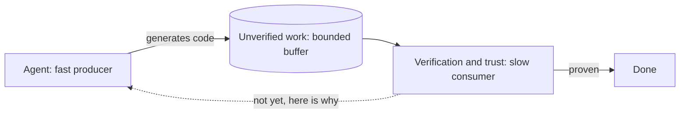
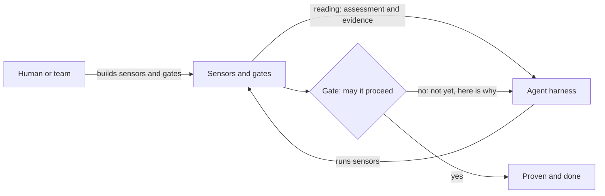

*Coding agents can produce a lot of code quickly. That is useful, but it also creates a simple problem: how do you know the work is correct before the agent moves on? Backpressure gives the harness a way to slow the agent down when the work has not been proven yet.*

> This is the first of a short series. Here I lay out the concepts: backpressure, sensors, and gates, and when each one is useful. A follow-up will cover how to define and run them in practice.
**Prefer to click through it?** There's an [interactive presentation of this post](https://dasith.me/presentations/backpressure/) that walks through the same ideas slide by slide.

## The server version

Most engineers meet backpressure in a server. The shape is usually the same: a fast producer, a slower consumer, and a bounded buffer between them. When the consumer cannot drain the buffer as fast as the producer fills it, the system sends a "slow down" signal upstream. That signal is backpressure. It shows up in TCP flow control, rate limits, bounded queues, and similar systems.

In that setting, the friction is usually something you try to reduce. Every request is value a user wanted served, so blocking or dropping it has a cost. The ideal server has enough capacity that backpressure is rare.

## The agent version

A coding agent harness is the set of tools, context, and checks around a model that writes code. In that setting, the friction has a different value.

The first output from an agent should be treated as provisional. It may be right, but it may also be plausible code heading in the wrong direction. If the agent keeps building on top of a wrong change, the cost of fixing it grows. Backpressure helps by making the agent stop at useful points and check the work before continuing.

Throughout this post, "harness" means this coding agent harness.

In a server, backpressure aligns production to the available capacity. In a harness, backpressure aligns progress to the rate at which work can be checked.

Inside a harness, backpressure is corrective feedback that resists forward progress until the work has a useful reading. It is how the harness says: not yet, and here is why. The strongest version is a pull model: each green check gives the agent permission to advance one more step.

## A small example

Say the agent changes an API endpoint.

A build tells us whether the code still compiles. A test tells us whether the endpoint still behaves as expected. A lint check tells us whether the code follows local rules. A reviewer prompt might tell us whether the change fits the architecture.

Those are readings. They do not write the code. They tell the agent and the human something about the work that cannot be known by looking at the changed files alone.

The useful part is not only that the readings exist. The useful part is what happens next. If the build is red, the agent should not be able to call the work done. If the tests fail, it should loop back with the failure details and fix the issue while the change is still small.

That is backpressure in the harness.

## The human and the harness

Two actors do all the work: the human (or team) and the agent harness. The human works on the code through the harness and rarely touches files directly any more. The agent harness is the thing that reads, writes, and runs code on their behalf.

The agent can perceive some things directly through ordinary tools: read a file, grep for a symbol, list a directory. That reveals the code's text. But the properties that decide whether work is correct cannot always be read from the text. Does it build? Do the tests pass? Does it hold to the architecture? You can stare at a function and still not know whether it compiles.

Those properties need something that takes a reading. This is where the human's leverage lives. The team's job is to give the harness the checks that reveal the things the agent cannot reliably infer. Without a reading, there is nothing useful to push back with.

## Sensors

A sensor is a tool that returns an assessment of a property of the work. All sensors are tools, but not all tools are sensors. Tools divide by what they do.

| Tool kind | Purpose | Example | Sensor |
|-------------------|----------------------------------------------|----------------------------------------|--------|
| Effector | change the world | write, edit, run a migration | no |
| Native perception | read directly-visible state | read file, grep, list dir | no |
| Sensor | measure a hidden property and return an assessment | build, test, lint, type check, reviewer subagent | yes |

The same raw mechanism can be either. `bash` running `rm` is an effector. `bash` running `npm test` is a sensor. What makes it a sensor is that its output is an assessment of correctness or quality, not data and not a change.

Sensors come in two classes.

* A deterministic sensor runs a repeatable tool. Build, test, lint, and type check sit here. It yields proof.
* An inferential sensor assesses the work against a rubric you wrote. A reviewer subagent checking an architecture pattern is this kind. It yields a useful but fallible opinion.

## What a sensor reports

A sensor answers a question about the work that the agent cannot answer by looking at the code: does it build, do the tests pass, does it hold to the architecture? It takes a reading and reports back an assessment together with the evidence behind it.

The assessment is the pass-or-fail answer. The evidence is what makes that answer useful, because a bare "it failed" tells the agent nothing it can act on. Often the evidence comes for free: a build that fails prints compiler diagnostics with file, line, and message. That is usually enough for the agent to find and fix the error. Where a sensor's raw output is poor, such as a cryptic stack trace or an opaque assertion, the team's job is to improve it into something the agent can act on. A sensor is only useful if its reading can lead to a correction.

The two classes differ in how the assessment is produced and how far to trust it.

| Aspect | Deterministic | Inferential |
|----------------------|------------------------------------------|----------------------------------------------|
| How it reads | a tool runs (build, test, lint, type check) | the model judges against a rubric you wrote |
| Trust | proof | advisory opinion |
| Catches | mechanical defects (will not compile, test red) | semantic defects (wrong abstraction, misread intent, security reasoning, taste) |

Both help, because they catch different defects. Deterministic sensors reliably catch structural defects but are blind to judgment. Inferential sensors catch semantic defects but are blind to mechanics. Run together, their gaps rarely align. And an inferential reading still beats no reading at all: where you cannot yet build a precise deterministic check, a review rubric at even seventy percent reliability catches much more than an unmeasured property.

## Gates

A reading on its own is only information. Backpressure appears when a gate refuses to let work advance on a red reading. Keeping the two ideas separate is the key move.

* A sensor only reads. It is perception.
* A gate is a rule that consumes a reading and resists progress. It is policy.
* Backpressure is what the agent feels when a gate refuses: not yet, and here is why.

Splitting them pays off three ways. One sensor can feed several gates: a test reading can gate both "may commit" and "may declare done". The same reading can block in one place and advise in another. A deterministic reading usually blocks. An inferential one usually starts as advisory. You can also change how strictly you gate without changing the sensor behind it.

A gate is only as strong as its enforcement. If the agent is free to skip it, it generates no backpressure at all, because offering an instrument is not the same as requiring its use. There is a spectrum here, from a gate the agent is merely instructed to honor to one enforced outside its control. The execution mechanism can vary. The principle is what matters here: the paved path must beat the shortcut.

The strength of the backpressure depends on three things: how much you check, how strongly you enforce those checks, and how much you trust the result. Coverage is how much of what matters is sensed at all. Strictness is how much is enforced rather than suggested. Trust is how much each reading is worth, where a deterministic proof should carry more weight than an inferential opinion. The stronger these are, the harder it is for wrong work to appear finished while proven work can keep moving.

Two composition rules follow. Run the cheap deterministic sensors first, such as type check, lint, and unit tests. Run the expensive inferential ones later, such as a review subagent. That catches most wrong work at low cost before it reaches a costly reading. Also make sure important paths to "done" have checks on them. If the agent can declare a risky step complete on its own, it can route around every sensor.

How a sensor and a gate are actually defined and run, the file shape, where they live, and how enforcement is wired, is the subject of a follow-up post. The ideas here, sensor versus gate and the separation between them, stand on their own.

## The lifecycle of a sensor and a gate

A sensor is created and matured through a lifecycle run by humans: identify the property worth measuring, formalize it into a sensor and a gate, execute it inside the agent loop, and improve it over time. This section covers the first stage: what prompts a sensor or a gate at all. The rest is the subject of the next post.

A sensor and a gate are different objects, so they are prompted by different failures. A sensor is perception; a gate is policy. You need a sensor when you could not see a problem, a perception gap. You need a gate when you could see it but nothing stopped it, an enforcement gap. A sensor answers "did we know?", a gate answers "did knowing change anything?" Most confusion about a harness comes from conflating the two.

### What prompts a sensor

The master signal is that a human is doing sensing work a machine or a rubric could do, or a defect reached a human because nothing sensed it. Every sensor removes a human from a feedback loop they should not be standing in. It shows up as four reactive signals and one proactive one:

* An escaped defect: something wrong reached review or production. The strongest signal, because it proves the property was both important and unsensed.
* The same correction by hand, repeated. The moment you notice you are the sensor again, you have found one.
* A near-miss caught late: you happened to notice it in review this time, but it could easily have slipped.
* The agent flails: it spins and burns tokens down wrong paths because no reading tells it whether it is on track. Here the sensor pays for itself in loop speed, not just correctness.
* A high-stakes invariant such as auth, tenant isolation, money, or data integrity. You instrument these before the first failure, because the first failure is the thing you are avoiding.

One diagnostic before building: was this a verification gap or a knowledge gap? If the agent did the wrong thing because nothing caught it, you want a sensor. If it did the wrong thing because it was never told the convention, you want a guide instead, or as well. Reaching for a sensor when the real gap was instruction is a common miss.

### What signals a gate

A gate is enforcement, so its triggers are about a reading that exists but does not bite:

* The reading is there and gets ignored: the agent skips the sensor, or sees red and proceeds anyway. This is the textbook sign to move a reading from advisory to enforced.
* The cost of escape is high or irreversible. Gate strictness should track blast radius: a security or data-loss property earns a hard block, a style nit does not.
* Trust in the reading has risen enough to block on it. You can only hard-block on a reading you trust, which is why deterministic proofs gate naturally and inferential opinions usually start advisory and earn a gate over time.
* There is an ungated path to done: work reaches "done" without the reading being decisive.

The inverse matters as much, because over-gating is its own failure. Do not add a gate when the stakes are low and the friction costs more than the defect, when the reading is noisy (a flaky sensor that hard-blocks creates false backpressure, which trains everyone to bypass it, worse than no gate), when it is genuine taste with no rubric, or when it would contradict an existing gate.

### Sense first, gate later

The two combine into a sequence. Sensing is cheap and safe to add: a new sensor can run in advisory mode and teach you something at low risk. Gating imposes friction on everyone, so you harden it once you trust the reading and the cost warrants it. A sensor can live ungated as pure observability. A gate always rides on a sensor, and "we need a gate" usually means "promote a reading we already have," not "build something new."

That splits the governance. A single engineer adds a sensor in the moment, cheaply, because an advisory reading harms no one. Hardening a gate is closer to a team act, often a retro decision, because blocking friction slows everyone and needs buy-in. Friction you impose on yourself is a preference; friction you impose on the team is policy.

Two litmus tests capture it.

For a sensor: something wrong happened and nothing automatic told the agent, or I checked that by hand.

For a gate: we knew it was wrong, it moved forward anyway, and that cost us.

## Closing

The basic rule is simple.

Add a sensor when the agent, or the human reviewing it, needs a reliable reading.

Add a gate when the reading already exists but ignored failures are still getting through.

Start by sensing. Gate only when the signal is trusted and the cost of letting the issue through is high enough.

A gate also tells you something about the harness itself. Its false positives and false negatives are a reading on sensor quality. A gate that keeps crying wolf is telling you to fix or retire the sensor behind it, not to tighten the gate. That is where the lifecycle loops back on itself. The team process for running that loop, formalizing a reading into a sensor, wiring its gate, and improving or retiring it as trust shifts and models change, is the subject of the next post.

## Concept lineage

This synthesis stands on the shoulders of people thinking out loud about harness engineering. The sources below are worth reading in full.

| Concept | Author | Source |
|---|---|---|
| Agent equals model plus harness | Vivek Trivedy, Addy Osmani, Birgitta Böckeler | [The Anatomy of an Agent Harness](https://www.langchain.com/blog/the-anatomy-of-an-agent-harness) |
| Do not waste your (human) backpressure | Moss Banay | [Don't waste your back pressure](https://banay.me/dont-waste-your-backpressure/) |
| Structural gate, capability versus certainty | Reuben Brooks | [Structural backpressure beats smarter agents](https://reubenbrooks.dev/blog/structural-backpressure-beats-smarter-agents/) |
| Guides (feedforward) and sensors (feedback), computational versus inferential | Birgitta Böckeler | [Harness engineering for coding agent users](https://martinfowler.com/articles/harness-engineering.html), [Maintainability sensors for coding agents](https://martinfowler.com/articles/sensors-for-coding-agents.html) |
| Success is silent and failures are verbose, hooks, the ratchet | Addy Osmani, HumanLayer | [Agent harness engineering](https://addyosmani.com/blog/agent-harness-engineering/), [Skill issue: harness engineering for coding agents](https://www.humanlayer.dev/blog/skill-issue-harness-engineering-for-coding-agents) |
| Feature list, pass-gating, work-in-progress of one, completion pressure | Walking Labs | [Learn Harness Engineering](https://walkinglabs.github.io/learn-harness-engineering/) |
