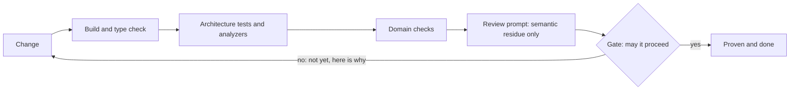

*The fastest way to start checking an architectural rule is to ask the model. The expensive part is asking the model to keep rediscovering facts a tool could have measured. A good inferential sensor should mature: keep the model for judgment, and move the ruleable parts into deterministic checks.*

> This continues a series on harness engineering. Part 1, [Manufacturing Backpressure in Coding Agent Harnesses](https://dasith.me/2026/06/14/backpressure-in-coding-agent-harnesses/), laid out sensors, gates, and backpressure. This post goes deeper on sensors: what makes a good one, and how to shift more of its work from opinion to proof so the checks cost less and vary less. A later post covers how to define, run, and enforce them in practice.


## Recap: sensors, gates, backpressure

A sensor takes a reading of the work. It returns an assessment with evidence. It does not change the code.

A gate consumes a reading and decides whether work may continue. Backpressure is what the agent feels when a gate says: not yet, and here is why.

Part 1 split sensors into two classes.

* A deterministic sensor runs a repeatable tool, such as a build, test, lint, or type check. It yields proof.
* An inferential sensor judges work against a rubric you wrote. It uses the model. It yields a useful but fallible opinion.

This post is about refining the second kind. The move is not to remove the inferential sensor. The move is to encode as much of its logic as possible into deterministic checks, then keep the model for the part that still needs judgment.

Encode, not replace.

## The job: enforce an architecture

Imagine a team working in a layered .NET codebase. The layers are `Shop.Api`, `Shop.Application`, `Shop.Domain`, and `Shop.Infrastructure`.

The team wants the usual boundaries to hold:

* Controllers in `Api` do not talk to repositories in `Infrastructure` directly.
* `Domain` does not depend on `Application`, `Api`, or `Infrastructure`.
* Command handlers live in `Application`.
* DTOs stay in `Api`.
* `Domain` stays persistence-ignorant: no infrastructure or ORM types, and no persistence assumptions leaking through method shapes or naming.

That last rule is worth noting now, because it has two halves. Part of it is structural: a reference to an `Infrastructure` or ORM type is a fact about the code. Part of it is not: a domain method can be shaped like a repository, or name a field after a database column, and leak persistence without referencing a single forbidden type. One half a tool can settle. The other half needs judgment. Hold on to that split; the whole post turns on it.

Nothing checks any of this today. The agent adds a feature, sees that the shortest path is to inject a repository into a controller, and does that. The code may build. The tests may pass. The architectural violation only appears when a human reads the pull request.

At that point the human is the sensor. That is exactly the situation we are trying to get out of.

This is one of the signals from part 1: the same correction by hand, repeated. The team has found a property worth measuring.

## Start with a prompt

The quickest sensor is a prompt.

Write the rules as a rubric and ask a reviewer subagent to check the change.

```text
You are reviewing a change for architectural fit in a layered codebase.
The layers, outermost to innermost, are Api, Application, Domain, Infrastructure.

Check the change against these rules:
- Controllers in Api must not depend on repositories in Infrastructure directly.
- Domain must not depend on Application, Api, or Infrastructure.
- Command handlers must live in Application.
- DTOs must stay in Api.
- Domain must not reference any infrastructure or ORM type.
- Each type sits in the layer its responsibility belongs to, not just a legal one.
- Abstractions are worth their weight, not just ceremony.
- No lower-layer assumption leaks through method shapes or naming without a direct dependency.
- The domain is modelled correctly, with the right invariants and value objects for the business rule.

For each problem, name the offending type and the rule it breaks.
```

That is an inferential sensor. It is also a perfectly reasonable first version.

A rubric is faster to write than a tool. Advisory feedback is low risk. And a fallible opinion is still much better than no reading at all. If the team is currently catching the issue by hand, a prompt that catches most cases is already progress.

So start there. Let it comment on the change. Do not make it a hard gate yet. You have a sensor on day one.

## The opinion gets expensive

The first version works, but the cost becomes visible quickly.

It spends tokens on bookkeeping. To answer the rubric, the model has to inspect the changed types, infer which layer each type belongs to, follow dependencies, and check whether each reference points in an allowed direction. That work happens again on every review.

It varies. The model may find a violation on one run and describe it differently on another. That is fine for advisory feedback. It is less fine for a hard gate.

It runs late. The model is usually the slowest sensor in the chain, so you want it after the cheap checks, not before them.

The important observation is that much of this review is not really judgment. `Domain` depending on `Infrastructure` is not a matter of taste. It is a fact about the dependency graph. The model is spending attention on a question a deterministic tool can answer.

That is the part to encode.

## Encode what you can

Split the rubric into two piles.

Some conditions are structural facts:

* Controllers must not depend on repositories.
* `Domain` must not depend on `Infrastructure`.
* Command handlers live in `Application`.
* DTOs stay in `Api`.

These are about namespaces, types, references, inheritance, and attributes. A tool can answer them.

Other conditions are semantic judgments:

* Is this type in the layer where its responsibility belongs?
* Does this abstraction help, or is it only ceremony?
* Did the code model the business rule correctly?

Those still need a model, or a human.

The rule of thumb is simple: when the inferential sensor is walking the tree, that part probably wants to become deterministic. Keep the reviewer prompt, but stop making it rediscover the facts that can be measured directly.

## Architecture tests as fitness functions

Architecture tests already have a name in the evolutionary architecture world: [architectural fitness functions](https://www.infoq.com/articles/fitness-functions-architecture/). A fitness function gives an objective assessment of an architectural characteristic.

Objective is doing the work there. A fitness function measures something true or false about the code. It is not a reviewer saying, "this feels wrong." In the language from part 1, it is a deterministic sensor.

In .NET, two libraries are useful here.

[NetArchTest](https://github.com/BenMorris/NetArchTest) gives you a fluent API over assemblies and types. The controller rule becomes a test:

```csharp
var result = Types.InAssembly(typeof(OrdersController).Assembly)
    .That().ResideInNamespace("Shop.Api.Controllers")
    .ShouldNot().HaveDependencyOn("Shop.Infrastructure")
    .GetResult();

var offenders = result.FailingTypeNames
                ?? Enumerable.Empty<string>();

Assert.True(
    result.IsSuccessful,
    "Controllers must not depend on infrastructure directly. Offenders: " +
    string.Join(", ", offenders));
```

[ArchUnitNET](https://github.com/TNG/ArchUnitNET), a .NET port of Java's ArchUnit, is a good fit for layer rules:

```csharp
using static ArchUnitNET.Fluent.ArchRuleDefinition;

private static readonly Architecture Architecture =
    new ArchLoader().LoadAssemblies(typeof(Shop.Domain.Order).Assembly).Build();

[Fact]
public void DomainShouldNotDependOnInfrastructure()
{
    Types().That().ResideInNamespace("Shop.Domain")
        .Should().NotDependOnAny(
            Types().That().ResideInNamespace("Shop.Infrastructure"))
        .Because("the domain layer must stay independent of infrastructure")
        .Check(Architecture);
}
```

The `Because` clause matters. It gives the agent a useful failure, not a bare red light. A sensor is only useful if its reading can lead to a correction.

These tests now carry the structural part of the review. No tokens. No variance. Same input, same result. The prompt no longer has to spend time proving that the domain should not reference infrastructure.

One tooling note: the original NetArchTest project has not had a release for a while. If you adopt it today, [NetArchTest.eNhancedEdition](https://github.com/NeVeSpl/NetArchTest.eNhancedEdition) keeps a very similar API and is maintained.

## Why this is cheap in a typed language

Typed languages make this kind of sensor easier because the program already carries a lot of shape.

The compiled output knows about assemblies, namespaces, types, signatures, inheritance, attributes, and references. NetArchTest and ArchUnitNET can read that directly. The model does not need to infer it from text.

Dynamic languages can still have architecture tests. [PyTestArch](https://github.com/zyskarch/pytestarch) does this for Python by parsing source files and building an import graph. That is useful, but it is a thinner reading. Import edges are not the same as type relationships, signatures, or call targets.

This is the broader point. Typed languages give the harness more surface area for deterministic sensors. More of the architecture can be measured by tools, which means more of the backpressure can be cheap and repeatable.

## Push it earlier with analyzers

Architecture tests run when the test suite runs. Analyzers can run earlier.

In .NET, Roslyn analyzers run during compilation and in the editor. That makes them excellent always-on sensors. If the agent writes a forbidden pattern, the build can report it immediately.

Some checks need no custom analyzer. With [BannedApiAnalyzers](https://www.nuget.org/packages/Microsoft.CodeAnalysis.BannedApiAnalyzers), you can ban a symbol with a line of text:

```text
P:System.DateTime.Now; Use a clock abstraction instead
```

Now direct use of `DateTime.Now` is a diagnostic. The reading has a location and a message, so the agent can act on it.

For richer rules, write a custom analyzer. For the cheapest baseline, turn on nullable reference types and treat warnings as errors. That moves another class of problems into deterministic land with very little ceremony.

A diagnostic is a reading. A build that fails on that diagnostic is a gate. The check has moved closer to the code being written.

## What stays inferential

Encoding the structural rules does not finish the job. That is the point. We are not replacing the inferential sensor.

Two kinds of work remain.

The first is not encoded yet. It is ruleable in principle, but no one has written the rule. The reviewer prompt can hold that responsibility until the team decides it is worth encoding. Over time, some of these checks graduate into tests or analyzers.

The second kind should stay inferential because it is judgment.

In the architecture example, that includes:

* Right layer, not legal layer: a type can sit in `Domain`, reference nothing forbidden, and still be an application concern in the wrong place.
* Abstraction quality: a rule can require `IHandler`; it cannot tell you whether the interface is useful.
* Coupling with no type edge: a domain method can leak an HTTP or persistence assumption through names and shapes without referencing an infrastructure type.
* Modelling: whether `Money` should be a value object, whether an invariant belongs on an aggregate, whether the business rule was understood.
* Justified exceptions: a deterministic check can say "violation." It cannot decide whether the exception is worth accepting.

After the deterministic checks move out, the prompt gets smaller and sharper:

```text
The layering is already checked by tests, so do not re-check dependency directions.
Judge only this: is each type in the layer its responsibility belongs to, are the
abstractions worth their weight, does the change leak a lower-layer assumption
without a direct dependency, and is the domain modelled correctly, with the right
invariants and value objects for the business rule? Name anything that is
structurally legal but wrong.
```

That is still an inferential sensor. It is now a better one. The model is no longer doing bookkeeping before it can think. It is judging the residue.

That covers four of the five judgments above. The fifth, deciding whether a flagged violation is worth accepting, is left out on purpose. A sensor reports; it does not adjudicate. Whether an exception stands is the gate's call, or a human's. That is the part 1 split again: sensors read, gates decide.

The gain is practical. The prompt is smaller. The model runs less often, because deterministic checks catch the mechanical failures first. The answer varies less, because the model is asked a narrower question.

## Wiring it into backpressure

The ordering follows directly from part 1: cheap deterministic sensors first, expensive inferential sensors later.



Each stage catches work before it reaches the next one. Most structural mistakes never reach the review prompt. They are caught by tools that are cheaper and more trusted.

Gate by trust.

| Sensor | Trust | Typical gate |
|---|---|---|
| Build, type check | proof | hard block |
| Architecture tests, analyzers | proof | hard block |
| Domain checks | proof | hard block |
| Review prompt | opinion | advisory, earns a gate over time |

A deterministic architecture rule is a natural hard gate. If the domain depends on infrastructure, block. The reading is repeatable and the evidence points to the offending type.

An inferential reading should usually start advisory. It can still create useful backpressure, but it needs trust before it deserves to block work.

There is also a middle ground. A fitness function can return a count. On an older codebase you may not block because the count is above zero. You block because the count got worse. That gives the team a ratchet: hold today's line, then tighten it over time.

## The sensor has matured

The architecture sensor started as one prompt.

That was the right starting point. It gave the team a reading quickly. It found drift before a human had to find it.

Then the repeated, ruleable parts moved into deterministic checks. NetArchTest and ArchUnitNET took over dependency rules. Analyzers moved some checks into the build. The prompt kept the semantic work.

The result is not tool instead of model. It is tool before model.

The deterministic layer carries the facts. The inferential sensor carries the judgment. Over time the deterministic layer grows, and the prompt shrinks to the part that cannot be encoded. It never shrinks to zero, because architecture is not only a dependency graph.

That is what maturing a sensor looks like.

## Closing

The goal is not to stop using inferential sensors. The goal is to stop paying them to do work that belongs in deterministic land.

Start with a prompt. Let it teach you what the team actually cares about. Then encode the stable, ruleable parts into tests and analyzers. Keep the model for judgment.

You get fewer tokens, less variance, and stronger backpressure. More proof, less opinion, without pretending that judgment can be compiled away.

How these sensors and gates are actually defined, run, and enforced in the harness, the file shape and where they live, is the subject of a later post.
